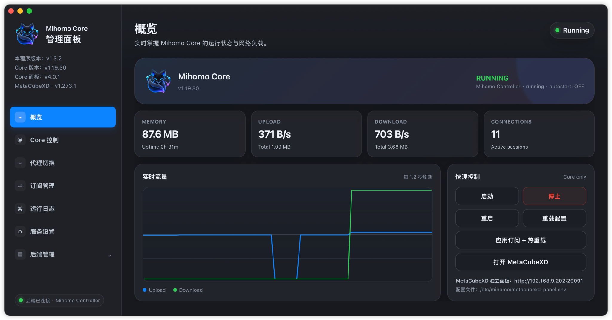
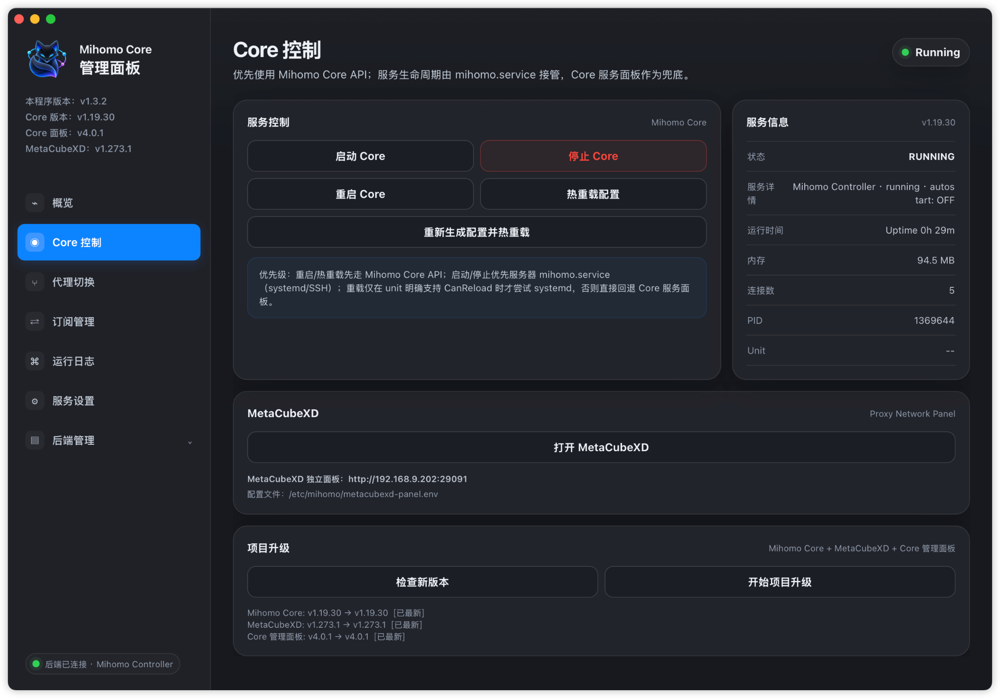

# MihomoManager for macOS v1.3.3

面向 **Apple Silicon macOS** 的 Mihomo 桌面管理客户端。项目同时维护 **GoWebUI** 与 **SwiftUI** 两套正式实现，用于管理远端 Mihomo Controller、Mihomo Core 管理面板、订阅、日志、代理策略和项目升级。

当前版本：**v1.3.3 (build 1303)**  
支持架构：**arm64**  
最低系统：**macOS 14.0**

## v1.3.3 本次优化

- **统一 SwiftUI / GoWebUI 左下角后端状态。** 后端连接成功时显示 `后端已连接 · <manager>`，例如 `后端已连接 · Mihomo Controller`；持续连接失败后显示 `后端未连接 · 检查设置`。
- **重新排版 Core 控制页的服务优先级说明。** 不再使用单段长文本，改为标题 + 四行缩进结构：
  - 重启/热重载先走 Mihomo Controller API；
  - 服务生命周期与日志随后走 Core 服务面板 API；
  - 避免因局域网直连失败而自动触发 SSH 认证；
  - 只有显式配置 SSH 目标时才尝试 `mihomo.service/systemd`。
- **README 重新按“当前版本 → 功能 → 安装 → 界面 → 架构 → 运维 → 发布 → 仓库结构”组织。** 历史版本细节统一保留在 [`CHANGELOG.md`](CHANGELOG.md) 与 `docs/releases/`，不再把所有旧版本逐段堆叠在项目首页。
- **根目录加入界面截图。** `HomePage.png` 与 `CorePage.png` 直接用于 README 预览。

> [!IMPORTANT]
> v1.3.0 起项目固定维护两套实现：**GoWebUI** 与 **SwiftUI**。两者共享 `VERSION`、`BUILD_NUMBER`、应用图标与发布版本，但 UI 源码独立。GoWebUI portable installer 与正式 GoWebUI `.pkg` 共用同一个 `scripts/build-gowebui-app.sh`；SwiftUI `.pkg` 由 Xcode 独立构建。两种实现最终都安装为 `/Applications/MihomoManager.app`，应二选一使用。

---

## 主要特性

- **Apple Silicon 原生目标**：发布产物固定为 `arm64`，最低 macOS 14.0。
- **双实现发布**：
  - GoWebUI：Go runtime + AppKit/JXA + WKWebView/Web UI。
  - SwiftUI：SwiftUI + AppKit 原生实现。
- **多服务器 Profile**：可保存多个 Mihomo 服务器并快速切换。
- **Mihomo Controller 直连**：读取 Core 版本、运行模式、连接数、流量、内存、代理组、Provider 和测速信息。
- **Core 生命周期管理**：启动、停止、重启、热重载采用 API-first 策略，显式 SSH/systemd 仅作为高级末级回退。
- **代理切换**：支持 `rule / global / direct` 模式、策略组节点切换与延迟测试。
- **订阅管理**：通过 Core 服务面板 `/api/subscriptions` 读取、保存并应用订阅配置。
- **运行日志**：优先使用 Core 服务面板历史日志接口；显式配置 SSH 后才允许 `journalctl` 回退。
- **项目升级**：调用 Core 服务面板的项目升级 API，检查和升级 Mihomo Core、MetaCubeXD 与 Core 管理面板。
- **MetaCubeXD 集成**：可从客户端打开独立 MetaCubeXD 页面，LAN / 公网地址均由 Profile 或服务端部署元数据决定，不猜测业务端口。
- **状态栏菜单**：运行状态、实时网速、常用 Core 操作和代理快捷切换可在 macOS 状态栏完成。
- **Keychain Secret**：Management Secret / Controller Secret 保存到 macOS Keychain，不写入普通 Profile JSON。
- **局域网访问声明**：SwiftUI 与 GoWebUI 都声明 `NSLocalNetworkUsageDescription`，面向 macOS 15+ 的 LAN Controller / Management / MetaCubeXD 访问。
- **端口不猜测**：不会自动补 `9090`、`29090` 或 `29091`；URL 的 scheme、显式端口与反向代理前缀以用户配置为准。
- **GoWebUI 本地桥接隔离**：只监听随机 `127.0.0.1` 端口，并使用每次启动生成的本地 token 保护 WebKit ↔ Go runtime 接口。

---

## 安装 / 更新 / 卸载

### 方法 A：GoWebUI portable installer

适合快速安装、ChatGPT Web / Linux 交付验证和本地 UI 验收。

安装包名称：

```text
MihomoManager-v1.3.3-GoWebUI-arm64-portable-installer.zip
```

使用步骤：

1. 在 Apple Silicon Mac 上解压 ZIP。
2. 双击：

```text
Install-MihomoManager.command
```

3. 安装脚本会把 App 安装到：

```text
/Applications/MihomoManager.app
```

4. 如果 Finder 因 Gatekeeper 阻止 `.command`，请打开“终端”，把 `Install-MihomoManager.command` 拖入终端窗口后回车执行。
5. portable preview 没有 Developer ID 公证；安装脚本会清理 quarantine、复制 App、执行 ad-hoc 签名并校验后启动。

### 方法 B：GitHub Release 正式安装包

正式 Release 同时发布两套明确区分的安装包：

```text
MihomoManager-v1.3.3-GoWebUI-arm64.pkg
MihomoManager-v1.3.3-SwiftUI-arm64.pkg
```

二者都安装到：

```text
/Applications/MihomoManager.app
```

因此同一台 Mac 上只需要选择其中一种实现；后安装的版本会覆盖前一实现的 App。

### 更新

安装更高版本的 `.pkg` 或运行新版 portable `Install-MihomoManager.command` 即可覆盖 App。

普通设置默认位于：

```text
~/Library/Application Support/MihomoManager/settings.json
```

GoWebUI 运行时快照位于：

```text
~/Library/Application Support/MihomoManager/Runtime/
```

Secret 保存在 macOS Keychain。覆盖 App 本身不会主动删除这些 Profile / Secret 数据。

### 卸载

portable 包提供：

```text
Uninstall-MihomoManager.command
```

它会停止 MihomoManager 并删除：

```text
/Applications/MihomoManager.app
```

也可以手工删除该 App。客户端卸载**不会**删除远端 Linux 服务器上的 Mihomo、MetaCubeXD 或 Core 管理面板，也不会自动清除本机 Application Support / Keychain 中保存的 Profile 和 Secret。

---

## 界面预览

### 概览



### Core 控制



---

## MihomoManager 管理界面

### UI 设计

两套正式实现保持相同的信息架构和功能目标：

- 左侧固定导航；
- 顶部页面标题与运行状态；
- 卡片式 Core / 流量 / 连接信息；
- 深色 macOS 风格界面；
- 状态栏常驻菜单；
- Core 控制、代理、订阅、日志、服务设置与后端管理入口。

GoWebUI 与 SwiftUI 不要求像素级完全一致；需要严格对照 GoWebUI 正式版本时，应比较：

```text
GoWebUI portable ↔ GitHub GoWebUI.pkg
```

因为两者共用同一 Go runtime、`portable-runtime/ui/index.html`、图标和 App builder。

### 页面职责

| 页面 / 模块 | 主要职责 |
|---|---|
| 概览 | Core 运行状态、内存、流量、连接数、实时流量图、快速控制 |
| Core 控制 | Core 启动/停止/重启/热重载、服务信息、MetaCubeXD、项目升级入口 |
| 代理切换 | 运行模式、策略组、节点选择、测速 |
| 订阅管理 | 读取、编辑并应用服务器端订阅 |
| 运行日志 | 获取历史日志并刷新显示 |
| 服务设置 | Management / Controller / MetaCubeXD / SSH / Keychain Secret / 刷新参数 |
| 后端管理 | 多服务器 Profile 选择、增删与切换 |
| 状态栏菜单 | 状态、网速、常用 Core 动作、代理快捷选择 |

### 左下角后端状态

v1.3.3 统一使用远端实际 manager，而不是展示本地 UI 技术栈：

```text
后端已连接 · Mihomo Controller
后端已连接 · Mihomo Core Management Panel
后端未连接 · 检查设置
```

实际成功文案取自状态返回的 `service.manager`；为空时使用兼容兜底名称。

---

## 后端与 API 架构

```text
┌──────────────────────────── Apple Silicon macOS ────────────────────────────┐
│                            MihomoManager.app                                │
│                                                                            │
│   SwiftUI/AppKit                              GoWebUI/AppKit/WebKit         │
│        │                                             │                     │
│        └──────────────────┬──────────────────────────┘                     │
│                           v                                                │
│                 Profile / Keychain / App Model                             │
└───────────────────────────┬────────────────────────────────────────────────┘
                            │
          ┌─────────────────┼──────────────────┐
          │                 │                  │
          v                 v                  v
  Mihomo Controller   Core 服务面板 API   显式 SSH / systemd
  /version            /api/status         mihomo.service
  /connections        /api/action         journalctl
  /configs            /api/logs           仅配置目标后启用
  /proxies            /api/subscriptions
  /group              /api/project-update/*
          │                 │
          └──────────┬──────┘
                     v
                 Mihomo Core
                     │
                     └──────── MetaCubeXD / Proxy Providers / Connections
```

### Mihomo Controller API

| 方法 | 路径 | 用途 |
|---|---|---|
| `GET` | `/version` | Core 在线探测与版本 |
| `GET` | `/connections` | 累计流量、连接数、内存快照 |
| `GET` | `/configs` | 读取运行配置 / 模式 |
| `PATCH` | `/configs` | 切换 `rule / global / direct` |
| `PUT` | `/configs?force=true` | 按 Profile 配置路径热重载 |
| `POST` | `/restart` | 原生 Core 重启 |
| `GET` | `/proxies` | 代理 / 策略组快照 |
| `GET` | `/group` | 策略组元数据 |
| `GET` | `/providers/proxies` | Provider 叶子节点与测速数据 |
| `GET` | `/group/{name}/delay` | 策略组测速 |
| `PUT` | `/proxies/{name}` | 选择策略组当前代理 |

Controller URL 可以直接粘贴 `/ui/`、`/Ui/`、`/version`、`/connections`、`/configs` 等已知路径；保存时会归一化到 API 根路径，同时保留反向代理前置路径和显式端口。

### Core 服务面板 API

| 方法 | 路径 | 用途 |
|---|---|---|
| `GET` | `/api/status` | 服务状态、部署元数据、版本 |
| `POST` | `/api/action` | Core 生命周期动作 |
| `GET` / `POST` | `/api/subscriptions` | 订阅读取、保存并应用 |
| `GET` | `/api/logs?lines=N` | 最近 N 行历史日志 |
| `GET` | `/api/project-update/check` | 检查三组件项目更新 |
| `POST` | `/api/project-update/apply` | 执行项目更新 |
| `GET` | `/api/project-update/log` | 项目升级日志 |

认证使用：

```http
Authorization: Bearer <Core Secret>
```

v4.0.1 Management API 可以复用同一 Mihomo Core Secret。MihomoManager 允许 Management Secret 与 Controller Secret 相互复用，避免同一凭据重复保存。

---

## Core 控制策略

v1.3.3 延续 v1.3.2 已确定的 **API-first / explicit-SSH** 策略，只重新整理界面说明，不恢复旧版“LAN 失败就自动尝试 SSH”的行为。

### 优先级

```text
优先级：
    重启/热重载先走 Mihomo Controller API；
    服务生命周期与日志随后走 Core 服务面板 API；
    避免因局域网直连失败而自动触发 SSH 认证；
    只有显式配置 SSH 目标时才尝试 mihomo.service/systemd。
```

### 操作矩阵

| 操作 | 第一优先 | 第二优先 | 最终回退 |
|---|---|---|---|
| 状态 | Mihomo Controller | Core 服务面板 | 显式 SSH/systemd |
| 启动 | Core 服务面板 | — | 显式 SSH/systemd |
| 停止 | Core 服务面板 | — | 显式 SSH/systemd |
| 重启 | Mihomo Controller `/restart` | Core 服务面板 `/api/action` | 显式 SSH/systemd |
| 热重载 | Controller `/configs?force=true` | Core 服务面板 `/api/action` | 显式 SSH/systemd，且仅 `CanReload=yes` |
| 历史日志 | Core 服务面板 `/api/logs` | — | 显式 SSH `journalctl` |
| 订阅事务 | Core 服务面板 | — | 无 systemd 等价操作 |
| 项目升级 | Core 服务面板 | — | 无 Mihomo `/upgrade` 等价操作 |

### SSH / systemd 规则

Profile 中只有显式填写：

```text
systemdSSHTarget
```

才启用 SSH 回退。

相关字段：

```text
systemdSSHTarget
systemdSSHPort
systemdIdentityFile
```

SSH 端口默认 `22`。未填写 SSH 目标时，即使局域网 Controller / Management 发生 `No route to host`、连接拒绝或超时，也不会因此弹出 SSH 密码/公钥认证路径。

systemd unit 固定为：

```text
mihomo.service
```

客户端不会接受任意 unit 名或任意远端 shell 命令。`reload` 只有在远端 unit 明确报告 `CanReload=yes` 时才允许执行。

---

## 订阅与项目升级

### 订阅管理

订阅读取与写入统一由 Core 服务面板负责：

```text
GET  /api/subscriptions
POST /api/subscriptions
```

“保存并应用”属于服务器端配置事务，不等同于 Mihomo Proxy Provider 的单纯刷新，因此客户端不会用 Controller 的 Provider API 机械替代它。

### 项目升级

MihomoManager 的“项目升级”针对服务器端整套组件：

```text
Mihomo Core
MetaCubeXD
Core 管理面板
```

接口：

```text
GET  /api/project-update/check
POST /api/project-update/apply
GET  /api/project-update/log
```

Mihomo 自带的 `/upgrade` 仅覆盖 Core，本项目不会拿它替代三组件项目升级。

---

## 网络与连接策略

### URL 与端口

客户端不会自动补常见业务端口：

| 端点 | 常见示例 | 实际规则 |
|---|---:|---|
| Mihomo Controller | `9090` | **不自动补**；使用 URL 自带端口 |
| Core 服务面板 | `29090` | **不自动补**；使用 URL 自带端口 |
| MetaCubeXD | `29091` | **不自动补**；使用 Profile / 服务端元数据 |
| SSH | `22` | 显式启用 SSH 后默认 22，可配置 |

省略 scheme 时只进行地址类型推断：

```text
LAN / private host  → http://
公共主机            → https://
```

如果用户已经显式填写 `http://` 或 `https://`，客户端不会替换。

### 局域网与浏览器 CORS

SwiftUI 使用原生 `URLSession`；GoWebUI 的远端请求由本地 Go runtime 发起。二者都不是浏览器直接请求远端 Controller，因此不受普通 Web 页面 CORS 规则限制。

MetaCubeXD 本身运行在浏览器中，浏览器直连 Mihomo Controller 时仍需要服务器正确配置 CORS / Private Network Access。

### GoWebUI 本地 runtime

GoWebUI 只监听：

```text
127.0.0.1:<随机高位端口>
```

端口由系统分配，不暴露到 LAN。WebKit 访问本地 runtime 时必须携带启动期随机生成的本地 token。

---

## 配置与数据位置

### 普通设置

```text
~/Library/Application Support/MihomoManager/settings.json
```

旧版路径：

```text
~/Library/Application Support/MihomoCoreManager/settings.json
```

仅用于兼容迁移。

### GoWebUI 运行数据

```text
~/Library/Application Support/MihomoManager/Runtime/
```

### Keychain

Management / Controller Secret 使用 macOS Keychain。v1.3.2 起统一使用：

```text
cc.kkr.MihomoManager.profile-secret
```

并保留旧 service 的迁移兼容。

### 远端配置路径

每个 Profile 可以单独指定 Mihomo 配置路径，例如：

```text
/etc/mihomo/config.yaml
```

Controller 热重载时会把该路径发送到 `/configs?force=true`；若转由服务器 Core 管理面板处理，最终路径由服务器端面板配置决定。

---

## 安全说明

MihomoManager 能够重启 Core、切换代理、修改订阅并触发服务器项目升级，应按管理工具对待。

建议：

- Controller 与 Core 服务面板使用强 Secret。
- LAN 明文 HTTP 只在可信网络内使用。
- 公网管理优先使用 HTTPS / VPN / Tailscale / WireGuard / 受控反向代理。
- 不把 `0.0.0.0` / `::` 当成客户端连接目标；它们是监听地址，不是可路由的服务器地址。
- 不把 9090 / 29090 / SSH 暴露到不可信公网。
- SSH 只在确实需要 systemd/journalctl 末级回退时显式配置。
- 不把真实 Secret、订阅 URL、SSH 私钥路径截图或提交到公开仓库。
- portable preview 使用 ad-hoc 签名，不等于 Developer ID 签名或 Apple 公证。

以下内容不应提交到 Issue / 日志截图：

```text
真实 Controller Secret
Management Secret
真实订阅 URL
SSH 私钥
敏感服务器地址
Keychain 导出内容
```

---

## 平台支持

| 项目 | 支持情况 |
|---|:---:|
| Apple Silicon macOS 14+ | ✅ |
| arm64 GoWebUI | ✅ |
| arm64 SwiftUI | ✅ |
| macOS Intel 原生发布目标 | ❌ |
| Windows | ❌ |
| Linux 桌面 App | ❌ |
| Linux 作为 ChatGPT / CI 交叉构建 GoWebUI portable 的开发环境 | ✅ |
| 远端 Linux Mihomo 服务器 | ✅ |

GitHub CI / Release 可以运行在 `macos-15-intel` 主机上，但最终产物必须交叉构建并验证为 **arm64-only**。

---

## 本地构建与验证

### 源码一致性检查

```bash
python3 scripts/build-gowebui-release-lock.py --check
python3 scripts/build-source-manifest.py --check
python3 scripts/validate-source.py
```

### GoWebUI 测试

```bash
cd portable-runtime
CGO_ENABLED=0 go test -count=1 ./...
CGO_ENABLED=0 go vet ./...
```

### GoWebUI portable

正式 GoWebUI 发布工具链固定 Go `1.26.8`。

```bash
bash scripts/build-portable-installer.sh
```

输出：

```text
dist-portable/
└── MihomoManager-v1.3.3-GoWebUI-arm64-portable-installer.zip
```

### SwiftUI 本地构建

需要 macOS + Xcode：

```bash
xcodebuild \
  -project MihomoCoreManager.xcodeproj \
  -scheme MihomoCoreManager \
  -configuration Debug \
  -destination 'platform=macOS' \
  ARCHS=arm64 ONLY_ACTIVE_ARCH=YES \
  build
```

### 双实现发布模拟

在 macOS Release 主机上：

```bash
bash scripts/simulate-release.sh
```

正式 unsigned Release：

```bash
bash scripts/build-release.sh --unsigned
```

需要 Apple Developer 签名链时可使用：

```bash
bash scripts/build-release.sh --signed
```

---

## GitHub 开发与发布

推荐版本开发流程：

```text
修改源码
→ 更新 VERSION / BUILD_NUMBER（如版本变化）
→ 更新 Release Notes / CHANGELOG
→ 更新 GoWebUI release lock（仅 GoWebUI 输入变化时）
→ 更新 SOURCE-SHA256SUMS.txt
→ validate-source / tests / release-preflight
→ 构建 GoWebUI portable 验证
→ Push
→ macOS CI 双实现 release simulation
→ 创建 / Push vX.Y.Z tag
→ Release workflow 构建并发布 GoWebUI.pkg + SwiftUI.pkg
→ 在线回读 SHA256SUMS 与发布资产
```

`.github/workflows/release.yml` 支持：

```text
push v* tag
workflow_dispatch(version)
```

正式 Release 固定 GoWebUI Go 工具链：

```text
Go 1.26.8
```

发布流程会在线回读并验证至少：

```text
MihomoManager-v1.3.3-GoWebUI-arm64.pkg
MihomoManager-v1.3.3-SwiftUI-arm64.pkg
SHA256SUMS.txt
GoWebUI-RELEASE-PROVENANCE.txt
SwiftUI-RELEASE-PROVENANCE.txt
```

---

## 仓库结构

下面按 v1.3.3 的实际职责列出主要源码与发布文件。

**图例：** `★` 运行源码　`◆` 构建 / 发布　`●` 验证 / QA　`○` 文档 / 参考

```text
MihomoManager-v1.3.3-source/
│
├── VERSION                                             # ◆ 当前版本：1.3.3
├── BUILD_NUMBER                                        # ◆ 当前 build：1303
├── README.md                                           # ○ 项目首页
├── CHANGELOG.md                                        # ○ 历史版本变更
├── SOURCE-SHA256SUMS.txt                               # ● 源码树 SHA-256 清单
├── GoWebUI-RELEASE-LOCK.json                           # ● GoWebUI portable / pkg 输入一致性锁
├── HomePage.png                                        # ○ README 概览截图
├── CorePage.png                                        # ○ README Core 控制截图
│
├── MihomoCoreManager.xcodeproj/                        # ◆ SwiftUI Xcode 工程
│
├── MihomoCoreManager/                                  # ★ SwiftUI / AppKit 实现
│   ├── MihomoCoreManagerApp.swift                      # ★ App 入口
│   ├── AppModel.swift                                  # ★ 主状态 / Profile / 轮询
│   ├── Models.swift                                    # ★ 数据模型
│   ├── Info.plist                                      # ◆ App bundle 配置 / LAN 权限说明
│   ├── API/
│   │   └── MihomoAPIClient.swift                       # ★ Controller / Management / SSH API
│   ├── Storage/                                        # ★ Profile / Keychain 存储
│   ├── Resources/                                      # ★ SwiftUI 资源
│   └── Views/
│       ├── ContentView.swift                           # ★ 主窗口 / 侧栏 / 后端状态
│       ├── OverviewView.swift                          # ★ 概览
│       ├── CoreView.swift                              # ★ Core 控制
│       ├── SubscriptionsView.swift                     # ★ 订阅
│       ├── LogsView.swift                              # ★ 日志
│       ├── SettingsView.swift                          # ★ 服务设置
│       ├── UpdateView.swift                            # ★ 项目升级
│       └── MenuBarView.swift                           # ★ macOS 状态栏
│
├── portable-runtime/                                   # ★ GoWebUI 正式实现
│   ├── go.mod                                          # ◆ Go module
│   ├── main.go                                         # ★ Go runtime / AppKit/JXA / API bridge
│   ├── main_test.go                                    # ● GoWebUI 单元测试
│   ├── README.md                                       # ○ GoWebUI 技术说明
│   └── ui/
│       └── index.html                                  # ★ Web UI / CSS / JavaScript
│
├── branding/                                           # ◆ 共享应用图标与品牌资源
│
├── scripts/                                            # ◆ 构建 / 发布 / 验证工具
│   ├── generate-app-icon.py                            # ◆ 生成 AppIcon
│   ├── build-gowebui-app.sh                            # ◆ 唯一 GoWebUI App builder
│   ├── build-portable-installer.sh                     # ◆ GoWebUI portable installer
│   ├── build-gowebui-release.sh                       # ◆ GoWebUI .pkg
│   ├── build-swiftui-release.sh                       # ◆ SwiftUI .pkg
│   ├── build-release.sh                               # ◆ 双实现正式 Release
│   ├── simulate-release.sh                            # ● 双实现发布全链路模拟
│   ├── build-gowebui-release-lock.py                  # ● GoWebUI 输入锁生成 / 校验
│   ├── build-source-manifest.py                       # ● 源码 SHA-256 manifest
│   ├── validate-source.py                             # ● 源码结构 / 版本 / UI 门禁
│   ├── release-preflight.py                           # ● Release 预检
│   ├── verify-macho-uuid.py                           # ● arm64 Mach-O LC_UUID 校验
│   └── github-release.sh                              # ◆ GitHub Release 发布 / 回读
│
├── docs/                                               # ○ 架构与发布文档
│   ├── ARCHITECTURE.md                                 # ○ SwiftUI / 后端架构
│   ├── RELEASE.md                                      # ○ 双实现发布流程
│   ├── RELEASE-GUARDRAILS.md                           # ● Release 防漂移规则
│   └── releases/
│       ├── v1.3.1/
│       ├── v1.3.2/
│       └── v1.3.3/                                     # ○ 当前版本 Release Notes / QA
│
├── .github/
│   └── workflows/
│       ├── ci.yml                                      # ● macOS CI
│       ├── release.yml                                 # ◆ 正式 Release
│       └── release-retry.yml                           # ◆ 已有 tag / Release 故障恢复
│
├── QA-v*.md                                            # ● 历史专项 QA 记录
├── API-AUDIT-v1.3.1.md                                 # ○ API 对照审计
├── FIX-v1.3.2.md                                       # ○ v1.3.2 修复说明
├── HOTFIX-v1.3.1-networking.md                         # ○ v1.3.1 网络 hotfix
└── VALIDATION.md                                       # ● 历史 / 发布验证说明
```

### 构建时生成、默认不提交的目录

```text
build/                                                  # ◆ 中间构建产物 / cache / App bundle
dist/                                                   # ◆ macOS 正式 Release 输出
dist-portable/                                          # ◆ GoWebUI portable 输出
DerivedData/                                            # ◆ Xcode 派生数据（如本地使用）
```

正式 `dist/` 典型资产：

```text
MihomoManager-v1.3.3-GoWebUI-arm64.pkg
MihomoManager-v1.3.3-SwiftUI-arm64.pkg
GoWebUI-APP-MANIFEST.json
SwiftUI-APP-MANIFEST.json
GoWebUI-RELEASE-PROVENANCE.txt
SwiftUI-RELEASE-PROVENANCE.txt
GoWebUI-RELEASE-LOCK.json
BUILD-VARIANTS.txt
release_v1.3.3_notes_zh-CN.md
SHA256SUMS.txt
```

### 安装后主要本机文件

```text
/Applications/MihomoManager.app

~/Library/Application Support/MihomoManager/
├── settings.json
└── Runtime/                         # GoWebUI 运行时状态（存在时）

macOS Keychain
└── cc.kkr.MihomoManager.profile-secret
```

这些是 **macOS 客户端本机数据**。远端 Mihomo Core、Core 管理面板和 MetaCubeXD 的实际安装路径由服务器端项目决定，不由 MihomoManager 本地安装器创建。

---

## 验证与发布文档

当前版本发布说明：

```text
docs/releases/v1.3.3/RELEASE-NOTES.md
```

当前版本 QA：

```text
docs/releases/v1.3.3/QA-v1.3.3.md
QA-v1.3.3.md
```

API / 网络相关历史审计：

```text
API-AUDIT-v1.3.1.md
HOTFIX-v1.3.1-networking.md
FIX-v1.3.2.md
```

完整历史版本变化统一查看：

```text
CHANGELOG.md
docs/releases/
```

---

## 许可证

当前源码树未提供独立 `LICENSE` 文件。正式对外分发前，仓库维护者应补充明确的项目许可证。

Mihomo、MetaCubeXD、Apple 平台组件以及其它第三方依赖分别遵循其各自上游许可证；本项目 README 不替第三方内容重新授权。
